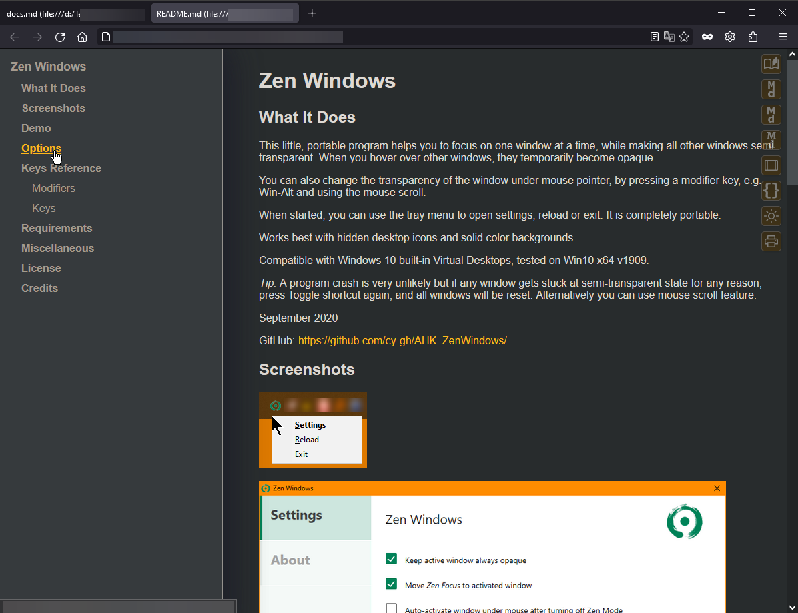
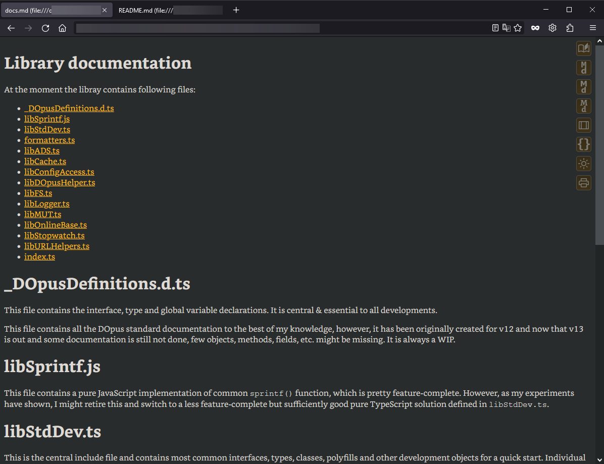
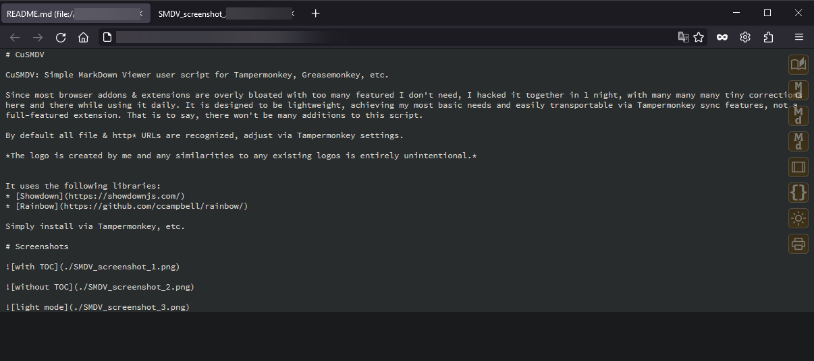

# CuSMDV

CuSMDV: Simple MarkDown Viewer user script for Tampermonkey, Greasemonkey, etc.

Since most browser addons & extensions are overly bloated with too many features I don't need, I hacked it together in 1 night, with many many many tiny corrections here and there while using it daily. It is designed to be lightweight, achieving my most basic needs and easily transportable via Tampermonkey sync features, not a full-featured extension. That is to say, there won't be many additions to this script.

By default all file & http* URLs are recognized, adjust via Tampermonkey settings.

*The logo is created by me and any similarities to any existing logos is entirely unintentional.*

It uses the following libraries:
* [Showdown](https://showdownjs.com/)
* [Rainbow](https://github.com/ccampbell/rainbow/)

Simply install via Tampermonkey, etc.

# Screenshots

